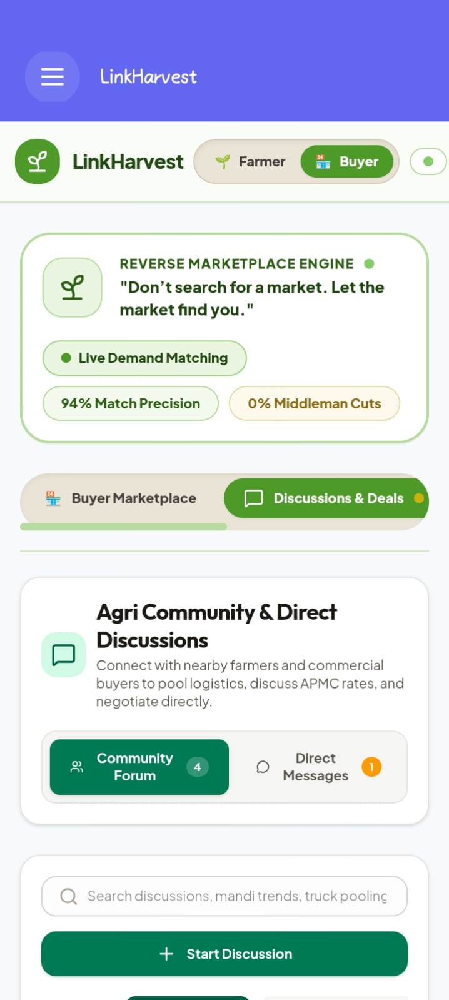
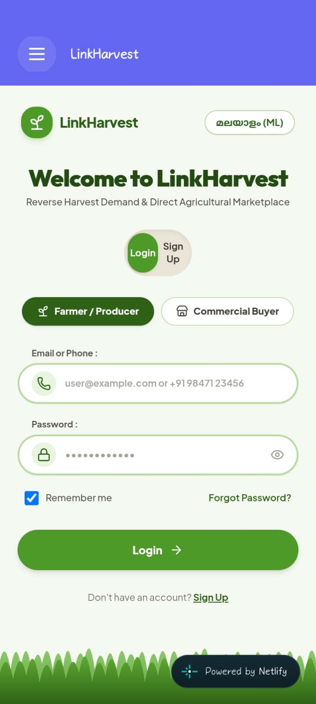
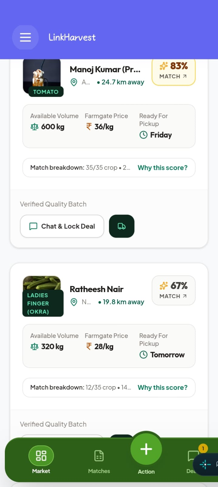
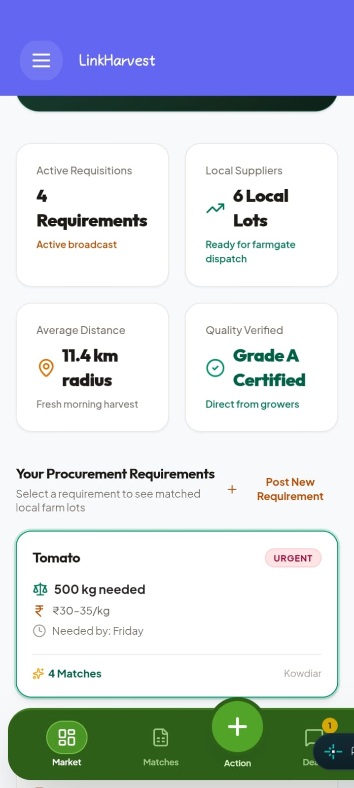
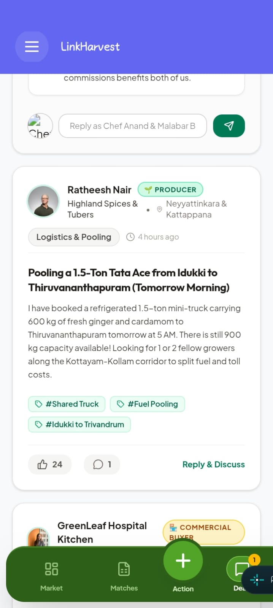
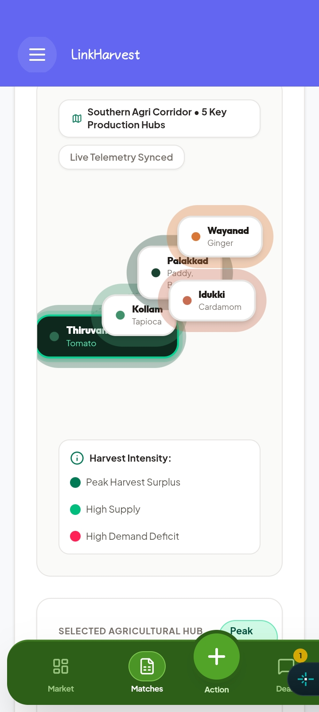
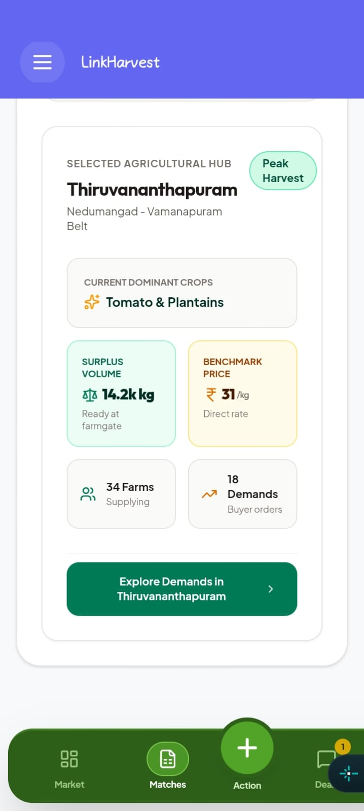

# 📱 LinkHarvest

<p align="center">

</p>

<h3 align="center">Don't search for a market. Let the market find you.</h3>

<p align="center">
A demand-driven agricultural market linkage platform connecting local producers directly with commercial buyers.
</p>

<p align="center">
<a href="https://github.com/devzzafk/AppSprint-2026/releases/tag/v1.0.0">Download APK</a>
&nbsp; • &nbsp;
<a href="https://linkharvests.netlify.app/">Live Demo</a>
&nbsp; • &nbsp;
<a href="https://github.com/devzzafk/AppSprint-2026">GitHub</a>
</p>

[](https://github.com/devzzafk/AppSprint-2026)
[](https://github.com/devzzafk/AppSprint-2026)

A mobile application built during **AppSprint Solution Challenge 2026**

---

# 👥 Team Information

## Team Name

**LinkHarvest**

**Team Size:** 1  
**Participation Type:** Individual

### Team Member

**Devi Chandran S**

## Challenge Track

**🌾 AgriTech / LocalTech**

A demand-driven market linkage platform connecting local producers with commercial buyers through intelligent matching, direct negotiation, and regional supply intelligence.

---

# 📖 Problem Statement

## The problem isn't always production. It's market access.

Small farmers and local producers often have products ready to sell but struggle to find the **right buyer at the right time, quantity, location, and price**.

At the same time, restaurants, hotels, hospitals, retailers, wholesalers, and other commercial buyers regularly need specific agricultural products but face difficulty discovering reliable local suppliers who can meet their requirements.

This creates a disconnect between **available supply and actual demand**.

### Who faces this problem?

**Local Producers**

- Farmers and small-scale producers with harvest-ready products
- Producer collectives and local suppliers
- Producers operating with limited access to digital markets

**Commercial Buyers**

- Restaurants and hotels
- Hospitals and institutional kitchens
- Retailers and wholesalers
- Businesses requiring predictable agricultural supply

### Why is this important?

A producer may have hundreds of kilograms of a crop available while a nearby business may simultaneously be looking for that exact product.

Yet the two may never discover each other.

This can lead to:

```text
Available Supply
       ↓
Poor Market Visibility
       ↓
Missed Buyer Connections
       ↓
Unsold / Under-valued Produce
```

---

# 💡 Solution

## A reverse marketplace built around real demand.

**LinkHarvest** changes the traditional agricultural marketplace model.

Instead of asking producers to list their products and wait for buyers to discover them, commercial buyers can **post what they actually need**, and LinkHarvest identifies producers who can potentially fulfill that demand.

The platform creates a direct loop:

> **Demand → Match → Connect → Trade**

---

# 🔄 How LinkHarvest Solves the Problem

## 01 // Buyers publish real demand

Commercial buyers can create structured requirements including:

- Crop / product
- Quantity required
- Quality or grade
- Target price
- Delivery deadline
- Location

This transforms vague market demand into a **specific procurement opportunity**.

## 02 // Producers discover relevant opportunities

Producers don't have to manually search through hundreds of listings.

LinkHarvest surfaces buyer demands that align with their available or expected supply.

Example:

```text
WHAT CAN I SELL?

Banana
300 kg available

92% MATCH

Buyer needs
250 kg

Target price
₹40 – ₹45 / kg

Distance
12 km
```

## 03 // Matching turns demand into opportunity

LinkHarvest uses **HarvestMatch**, a transparent rule-based scoring engine that evaluates supply-demand compatibility.

```text
Crop & Quality       35%
Price Parity         25%
Proximity            20%
Quantity             20%
────────────────────────
Total               100%
```

Instead of simply showing listings, the platform explains **why** a particular producer or demand is a strong match.

## 04 // Producers and buyers connect directly

Once a relevant match is found, both sides can communicate directly.

The platform supports:

- Direct messaging
- Trade context
- Price negotiation
- Quantity discussion
- Location sharing
- Deal confirmation

## 05 // The transaction can be locked in

The **Lock In Deal** workflow records the agreed:

- Crop
- Quantity
- Price
- Delivery date
- Participants

This creates a clear transition from **discovery → negotiation → agreement**.

---

# ✨ Features

## 01 // Reverse Marketplace

**Demand → Supply**

- Commercial buyers post real-time procurement requirements.
- Producers discover active buyer demands matching their crops.
- Dedicated Producer and Buyer workspaces.
- Seamless role switching between Producer and Buyer.
- Demand-driven discovery instead of a traditional product catalogue.

---

## 02 // HarvestMatch Engine

**Find the right producer for the right demand.**

- 0–100% Fit Index
- Crop & quality compatibility
- Price parity analysis
- Geospatial proximity
- Quantity & batch alignment
- Transparent score breakdown
- Explainable matching instead of black-box recommendations

```text
Crop & Quality       35%
Price Parity         25%
Proximity            20%
Quantity             20%
────────────────────────
Total               100%
```

---

## 03 // What Can I Sell?

Producers can discover buyer opportunities based on the supply they already have available.

Example:

```text
BANANA

300 kg available

92% MATCH

Buyer Requirement
250 kg

Target Price
₹40 – ₹45 / kg

Distance
12 km
```

This converts existing inventory into actionable market opportunities.

---

## 04 // Direct Negotiation

Once a producer and buyer are connected, they can communicate without unnecessary intermediaries.

Features include:

- 1-to-1 buyer-producer chat
- Persistent trade information
- Crop and quantity context
- Target price visibility
- Negotiation actions
- Deal locking

Example actions:

```text
[ Confirm ₹48/kg ]

[ Share GPS Location ]

[ Adjust Quantity ]

[ Lock In Deal ]
```

---

## 05 // Community Forum

LinkHarvest provides a community layer for discussions related to agricultural trade.

### Categories

```text
Price & Mandi Trends
Logistics & Pooling
Buyer Direct Contracts
Farming & Crop Care
```

Users can:

- Search discussions
- Filter topics
- Create posts
- Add tags
- Reply to discussions
- Discuss market trends
- Coordinate logistics

---

## 06 // Vernacular Voice Assistant

Creating a listing should not require extensive typing.

LinkHarvest supports a voice-based listing workflow for:

- English
- Malayalam

A producer can speak information such as:

```text
"500 kilograms of Grade A tomato,
available next week at around
₹32 per kilogram."
```

The workflow structures the information into:

```text
Crop
Quantity
Quality
Expected Harvest
Target Price
```

This makes the listing workflow more accessible for users who may not be comfortable with complex digital forms.

---

## 07 // Offline-First Workflow

Agricultural connectivity can be inconsistent.

LinkHarvest includes a local synchronization workflow for weak or disconnected network conditions.

```text
Create Listing
      ↓
Local Sync Queue
      ↓
Network Restored
      ↓
Synchronize
      ↓
Supabase
```

The prototype also includes a network simulator to demonstrate online and offline states.

---

## 08 // Shared Logistics & Cold Chain

Nearby producers can coordinate shared transport and pooled logistics.

Example:

```text
Farm A
   ↓
Farm B
   ↓
Farm C
   ↓
Collection Hub
   ↓
Buyer
```

The prototype also represents simulated cold-chain telemetry:

```text
Temperature     4.2°C
Truck Capacity  78%
Route Status    Active
```

---

## 09 // Geospatial Harvest Intelligence

The Harvest Heatmap provides a regional view of agricultural supply and demand.

It highlights:

- Production clusters
- Supply concentration
- Buyer activity
- Regional demand
- Price momentum
- Active agricultural hubs

Example regions represented in the prototype:

```text
Nedumangad
Kattappana
Neyyattinkara
```

---

## 10 // Agricultural Hub Intelligence

The agricultural hub dashboard combines local market information into one view.

Example:

```text
14.2k kg
Regional Supply

₹31/kg
Benchmark Price

34
Active Farms

18
Active Demands
```

This helps users understand regional market activity rather than looking only at individual listings.

---

## 11 // Authentication & Persona Management

LinkHarvest supports two primary workspaces.

### Producer

```text
Login
  ↓
Inventory
  ↓
Buyer Opportunities
  ↓
HarvestMatch
  ↓
Connection
  ↓
Negotiation
```

### Commercial Buyer

```text
Login
  ↓
Post Demand
  ↓
Matching Producers
  ↓
HarvestMatch
  ↓
Connection
  ↓
Negotiation
```

The prototype also provides demo personas for quick evaluation.

---

## 12 // Accessibility & Local Usability

LinkHarvest includes:

- English / Malayalam interface
- Voice-based listing workflow
- High-contrast interface
- Clear information hierarchy
- Mobile-first layouts
- Offline workflow
- Accessible interaction patterns

---

# 📱 Screenshots

## 01 // Dual Persona Entry

<p align="center">

</p>

Farmers and commercial buyers enter the same marketplace through role-based workflows.

---

## 02 // Reverse Marketplace

<p align="center">

</p>

Buyer demand becomes a direct opportunity for local producers.

---

## 03 // HarvestMatch Engine

<p align="center">

</p>

Producers are ranked using transparent crop, price, distance and quantity matching.

---

## 04 // Demand-Driven Procurement

<p align="center">

</p>

Commercial buyers publish requirements and discover matching local supply.

---

## 05 // Community + Direct Negotiation

<p align="center">

</p>

Producers and buyers can discuss logistics, market trends and trade directly.

---

## 06 // Geospatial Harvest Intelligence

<p align="center">

</p>

Regional production hubs reveal supply concentration and market activity.

---

## 07 // Agricultural Hub Intelligence

<p align="center">

</p>

Local crop volumes, supplying farms, buyer demand and benchmark prices in one view.

---

# 🎥 Demo Video

Add your final demonstration video here.

**Maximum Duration:** 2 minutes

The demonstration should cover:

- Problem
- Solution
- Producer workflow
- Buyer workflow
- Demand creation
- HarvestMatch
- Direct negotiation
- Key differentiating features

**Demo Link:**  
https://youtube.com/your-demo-link

---

# 📦 APK Download

The Android APK is available through the GitHub Release.

**LinkHarvest v1.0.0**

https://github.com/devzzafk/AppSprint-2026/releases/tag/v1.0.0

---

# 🛠️ Tech Stack

LinkHarvest is built as a cross-platform mobile application with a cloud-backed architecture and an offline-first workflow.

## Frontend / Mobile Framework

- **React Native**
- **Expo**
- **TypeScript**
- **Expo Router**

## Backend

- **Supabase**
- **Supabase Auth**
- **Supabase PostgreSQL**
- **Supabase Realtime**
- **Supabase Storage**

## Database

- **PostgreSQL**
- **Local persistence / Sync Queue**

### Core Database Entities

```text
Profiles
Products
Demands
Connections
```

## APIs / Services

| Service | Purpose |
|---|---|
| Supabase Auth | Authentication and user sessions |
| Supabase PostgreSQL | Application data |
| Supabase Realtime | Live synchronization |
| Supabase Storage | File and media storage |
| Geospatial Services | Distance and regional matching |
| Voice Processing | Voice-to-structured listing workflow |

## Architecture

```text
┌─────────────────────────────┐
│      React Native + Expo    │
│         TypeScript          │
└──────────────┬──────────────┘
               │
               ↓
┌─────────────────────────────┐
│     Application Services    │
│                             │
│ HarvestMatch │ Offline      │
│ Voice        │ Logistics    │
└──────────────┬──────────────┘
               │
               ↓
┌─────────────────────────────┐
│          Supabase           │
│                             │
│ Auth │ REST │ Realtime      │
│ Storage │ PostgreSQL        │
└─────────────────────────────┘
```

---

# 🚀 Installation

## Clone Repository

```bash
git clone https://github.com/devzzafk/AppSprint-2026.git
```

## Navigate to Project

```bash
cd AppSprint-2026/LinkHarvest
```

## Install Dependencies

```bash
npm install
```

## Environment Variables

Create a `.env` file inside the `LinkHarvest` directory:

```env
EXPO_PUBLIC_SUPABASE_URL=your_supabase_url
EXPO_PUBLIC_SUPABASE_ANON_KEY=your_supabase_anon_key
```

Do not commit `.env` files or private credentials to GitHub.

## Run Application

```bash
npx expo start
```

The application can then be opened using:

- Android Emulator
- Expo Go
- Development Build

---

# 📂 Project Structure

```text
AppSprint-2026/
│
├── README.md
│
├── LinkHarvest/
│   │
│   ├── assets/
│   │   ├── agricultural-hub.png
│   │   ├── buyer-demand.png
│   │   ├── community.png
│   │   ├── harvest-heatmap.png
│   │   ├── harvest-match.png
│   │   ├── login.png
│   │   └── reverse-marketplace.png
│   │
│   ├── src/
│   │   ├── app/
│   │   │   ├── auth/
│   │   │   ├── dashboard/
│   │   │   ├── demand/
│   │   │   └── inventory/
│   │   │
│   │   ├── lib/
│   │   │   └── supabase.ts
│   │   │
│   │   └── services/
│   │       ├── matching.ts
│   │       └── matching.test.ts
│   │
│   ├── package.json
│   ├── app.json
│   └── ...
│
└── .gitignore
```

---

# 🌟 Key Highlights

## 01 // Demand-first instead of listing-first

Traditional marketplaces generally ask producers to list products and wait for buyers.

LinkHarvest starts with **actual buyer demand** and works backwards to find relevant supply.

```text
Traditional

Seller → Listing → Search → Buyer


LinkHarvest

Buyer Demand → Match → Producer → Connection → Trade
```

## 02 // Explainable Matching

HarvestMatch does not simply output a recommendation.

It exposes the factors behind the score:

```text
Crop & Quality       35%
Price Parity         25%
Proximity            20%
Quantity             20%
```

This makes the matching process easier to understand and validate.

## 03 // Two-sided Marketplace

The application is designed around both sides of the agricultural transaction:

```text
Producer
   ↕
LinkHarvest
   ↕
Commercial Buyer
```

## 04 // Built for Real-World Constraints

The prototype addresses challenges beyond basic marketplace discovery:

- Connectivity
- Language barriers
- Logistics
- Cold-chain coordination
- Regional supply visibility
- Direct negotiation

## 05 // Local-first Approach

The platform focuses on connecting nearby agricultural supply with nearby commercial demand, potentially reducing unnecessary discovery and logistics friction.

---

# 🔮 Future Improvements

Features planned for future versions:

- Predictive demand forecasting
- Dynamic mandi price intelligence
- Verified farmer cooperatives
- Digital contracts
- Integrated payment settlement
- Logistics provider integration
- Real IoT-based cold-chain monitoring
- Government procurement integration
- ONDC / open commerce integration
- Regional demand forecasting
- AI-assisted crop quality analysis

---

# 📊 Impact

## Target Users

### Producers

- Small and medium-scale farmers
- Local producer groups
- Agricultural collectives
- Local suppliers

### Buyers

- Restaurants
- Hotels
- Hospitals
- Institutional kitchens
- Retailers
- Wholesalers
- Other commercial businesses

## Benefits

LinkHarvest aims to:

```text
Improve Market Discovery
          ↓
Increase Producer Visibility
          ↓
Enable Direct Buyer Connections
          ↓
Support Better Negotiation
          ↓
Improve Local Procurement
          ↓
Reduce Avoidable Logistics Friction
```

The platform is designed around a simple principle:

> **The producer should not always have to search for the market.**

Instead, relevant market demand should be able to find the producer.

---

# 📜 License

This project is licensed under the MIT License.

---

# 🏆 AppSprint Solution Challenge 2026

Built with ❤️ during **AppSprint Solution Challenge 2026**

Organized by:

**App Development IG · muLearn LBSITW**

---

<p align="center">

<strong>LinkHarvest</strong>

<br>

Demand → Match → Connect → Trade

<br><br>

Built for AppSprint 2026

</p>
